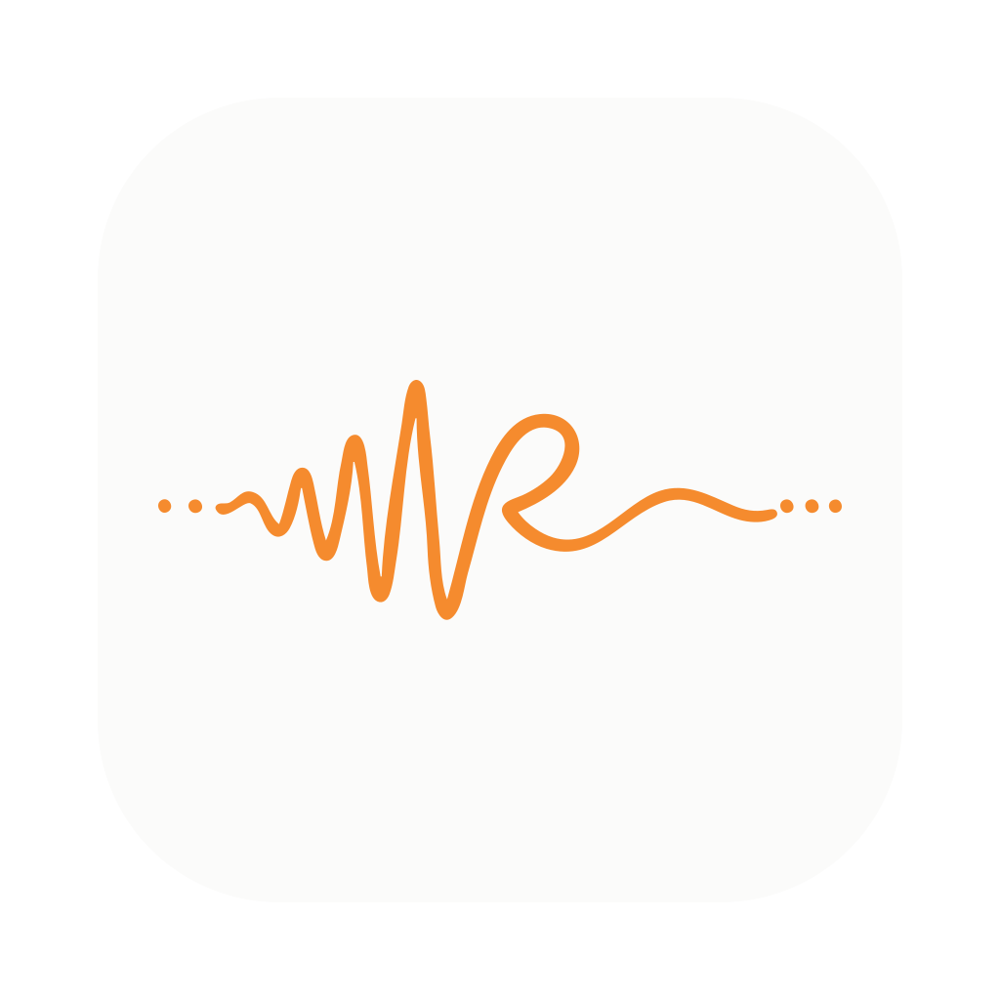
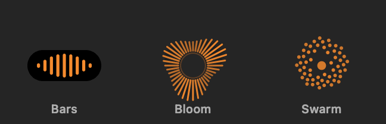
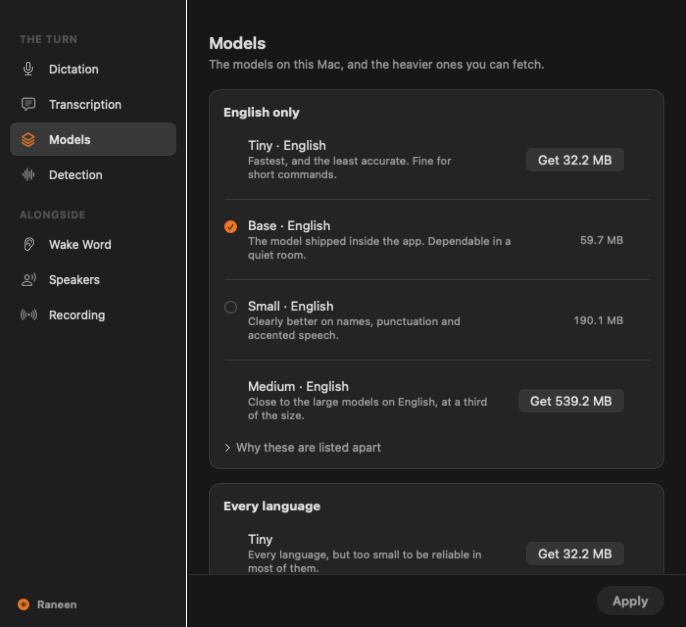
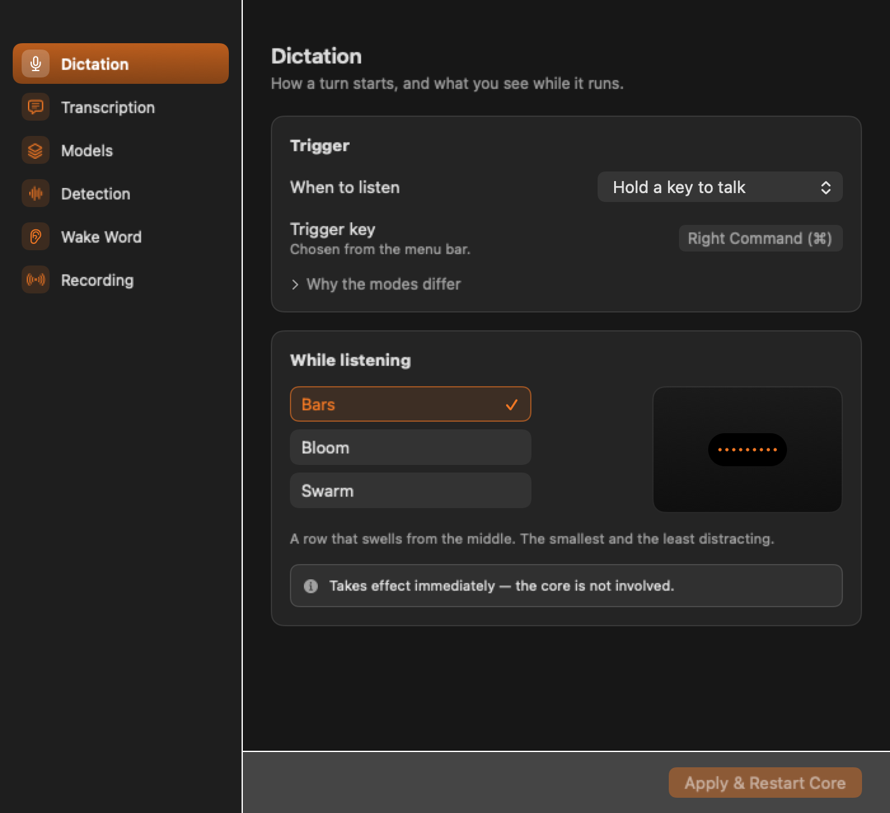
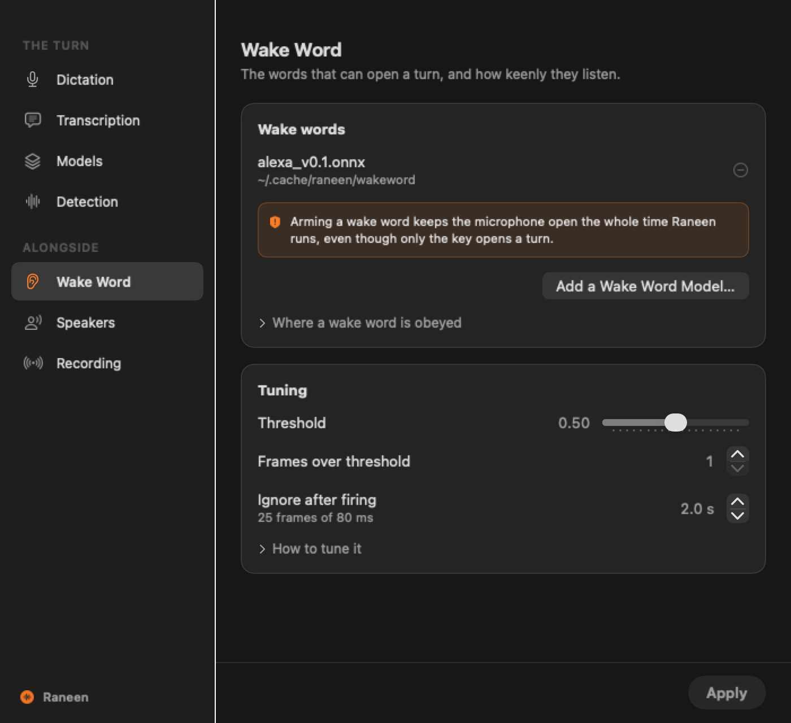
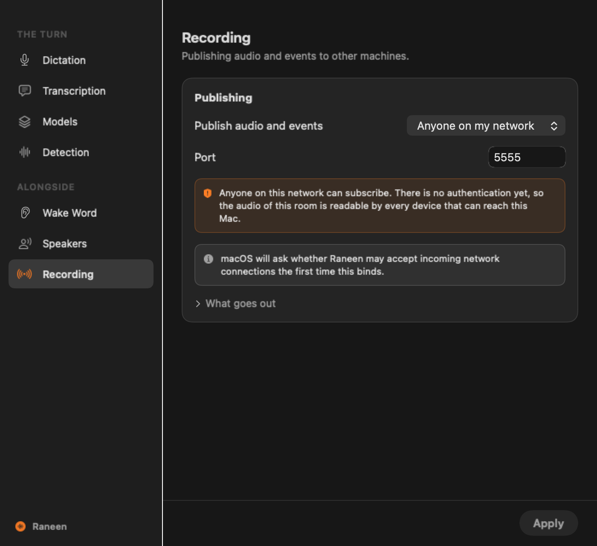

<div align="center">



# Raneen

**Hold a key. Speak. The words land where your cursor is.**

Private dictation for macOS. Whisper runs on your Mac's own GPU —
no account, no subscription, and your voice never leaves the machine.

[](../../releases/latest)
[](../../actions/workflows/tests.yml)


</div>

<p align="center">
  
</p>

<p align="center"><em>While it listens, a small panel floats over your work. Pick the one you can ignore.</em></p>

## Why this one

- **It types into whatever has focus.** Any editor, any browser, any text
  field — no plug-in, no per-app setup. If you can put a cursor there, you can
  talk there.
- **Hold-to-talk that actually waits for you.** Holding the key ignores the
  voice detector completely, so pausing mid-sentence to think cannot cut you
  off. Prefer hands-free? A wake word or plain voice activation both work too.
- **Your accuracy is a slider, not a plan tier.** Twelve Whisper models from a
  32 MB `tiny.en` to the 3.1 GB `large-v3`, downloaded inside the app and
  verified against a pinned SHA-256 before they're installed. No Finder, no
  terminal.
- **Multilingual when you need it.** Thirteen languages in the picker or
  automatic detection — or an English-only model, which is smaller and sharper
  on English.
- **Light.** A menu-bar app around one static binary: 65–90 MB of RAM at rest
  with `base.en` loaded ([measured](docs/ARCHITECTURE.md)), transcribing
  through Metal on the GPU. No Python, no Electron, no runtime to install.

## Get it

**[Download the latest DMG](../../releases/latest)** — about 67 MB, signed and
notarised, with the `base.en` model already inside. It works the moment it
opens. Apple Silicon, macOS 13 or newer.

On first launch it asks for two permissions, and it's fair to want to know why:

| | |
| --- | --- |
| **Microphone** | to hear you |
| **Accessibility** | to see the trigger key — a bare modifier press is invisible to apps without it — and to type the result into other apps |

There is no Dock icon. Look for the waveform mark in the menu bar; it turns
orange while a dictation is live.

Then: **hold Right Command, speak, release.** That's the whole workflow. Any
bare right-hand modifier can be the trigger instead — they're all keys that
produce no character, so the trigger can never corrupt what you're dictating
into.

## What it looks like

| | |
| --- | --- |
|  |  |
| **Models.** Pick a heavier model and it downloads in place — progress, a cancel, a delete. Nothing is installed until its SHA-256 matches. | **Dictation.** What opens a turn, and what you watch while it runs. The animation previews itself, because three names in a list are not a choice. |
|  |  |
| **Wake word.** Any openWakeWord `.onnx`, including one you trained. It is always *reported*; it only *opens a turn* in wake-word mode. | **Recording.** Speech-gated audio and every event, out to the network — for a recorder on a NAS or a Pi in another room. Dictation keeps working while it runs. |

<sub>Screenshots are generated from the real views by `make -C apps/Raneen
screenshots`. The sidebar is translucent in the app; an offscreen render
cannot capture vibrancy.</sub>

## Where your audio goes

Nowhere, unless you send it somewhere. The defaults keep everything on the
machine:

- **Transcription is local.** whisper.cpp, in-process, on the GPU. Pointing
  the app at a remote server — your own on a NAS, or OpenAI — is an explicit
  choice in Settings, never a fallback you didn't ask for.
- **Transcribed text is never written to any log, at any level.** It is the
  most sensitive thing the app touches; the log files record lengths and
  timings only.
- **The network is opt-in, item by item.** A model download you clicked,
  a remote server you configured, or the ZeroMQ publisher you switched on —
  and that last one tells you, in the window, that the stream is currently
  unauthenticated before you enable it.

And it's all open source, so none of the above has to be taken on faith.

## Building it yourself

Needs the Xcode command-line tools and a Rust toolchain. The first build takes
a few minutes — whisper.cpp compiles from source; later builds are seconds.

```bash
make -C apps/Raneen dmg
```

That builds the Rust core, fetches the `base.en` model, assembles and signs
`apps/Raneen/build/Raneen.app`, and packages the DMG. `make app` stops before
signing; `make run` launches with the engine's logs on your terminal. There is
no Xcode project — bundle layout and signing are plain Makefile, reviewable as
text.

> **Sign with a real identity if you can.** An ad-hoc signature changes with
> every rebuild, so macOS treats each build as a brand-new app: the
> Accessibility grant silently stops applying and the hotkey dies with no
> error anywhere. The Makefile warns when it falls back to ad-hoc.

Apple Silicon only, deliberately: whisper.cpp picks its CPU instructions at
compile time, so a single x86 binary would either crash on older Intel Macs or
waste the newer ones.

---

## Under the hood

Raneen the app is a thin Swift shell around **`raneen-core`**, a Rust engine
that turns sound into text and nothing else. Two rules explain the whole
repository:

1. **The core never touches a device.** It takes PCM16 frames on a socket and
   writes newline-JSON events to stdout. Microphones, hotkeys and text
   insertion belong to the shell.
2. **The core never decides what the text is for.** Dictation types it, an
   assistant answers it, a recorder files it — all consumers of one event
   stream.

Which is why the same engine also runs two other products:

| | Where | What |
| --- | --- | --- |
| **The engine** | [`crates/raneen-core`](crates/raneen-core) | local + remote + streaming STT, Silero VAD, wake words, continuous speaker identification, always-on recorder, ZeroMQ — [its own README](crates/raneen-core/README.md) covers driving it directly |
| **Pi appliance** | [`packages/voice-assistant`](packages/voice-assistant) | a ReSpeaker voice assistant: wake word → agent → speaker, LED ring, music ducking |
| **Desktop CLI** | [`packages/voice-desktop`](packages/voice-desktop) | dictation and the assistant from a terminal — Linux, Windows, macOS |
| **The contract** | [`protocol/`](protocol) | the wire spec, plus a conformance harness that checks any implementation |

### The Pi appliance

**If you came here for the ReSpeaker Pi assistant, it still works** — that is
where this project started, and it is still shipping. The pipeline it
pioneered is what became the shared core.

```bash
cd packages/voice-assistant
cp config/config.yaml.example config/config.yaml
uv sync && uv run voice-assistant download-models
uv run voice-assistant run
```

Targets a Raspberry Pi 4B with a ReSpeaker 4-Mic Array (AC108 capture, 12
APA102 LEDs). Commands, tuning, wiring and troubleshooting live in
[its README](packages/voice-assistant/README.md) — start with
`voice-assistant test events`, which needs no API key and shows every
detection live.

### Development

```bash
# The app (from apps/Raneen)
swift test

# The engine — hermetic unit tests: no model, no audio hardware
cargo test --release --manifest-path crates/raneen-core/Cargo.toml

# The conformance suite — a real helper, real audio, asserts on transcripts
./protocol/run-suite.sh rust      # `python` runs the same against the reference

# Python
uvx ruff check packages/ && (cd packages/voice-core && uv run pytest)
```

The conformance suite is the anti-drift check between the two implementations,
not a duplicate of the unit tests: every case pins behaviour a real bug has
broken at least once. It earned its keep on its first run by catching one
implementation losing the first ~320 ms of every stream.

```
crates/raneen-core/     Rust — THE ENGINE. Buses, VAD, triggers, STT, ZeroMQ
apps/Raneen/            Swift — the macOS app: Core Audio, hotkey, text insertion
packages/               Python — uv workspace: Pi appliance, desktop CLI, shared core
protocol/               the wire contract. Everything here ASSERTS — CI runs it
tools/                  human-facing: watch, inspect, try a real microphone
examples/               for consumers of the ZeroMQ wire format
docs/                   architecture, decisions, roadmap, measured facts
```

### Documentation

| | |
| --- | --- |
| [docs/PRODUCT.md](docs/PRODUCT.md) | what is being shipped and what is left. **Start here** |
| [docs/ARCHITECTURE.md](docs/ARCHITECTURE.md) | layers, boundaries, the memory measurements |
| [docs/DECISIONS.md](docs/DECISIONS.md) | why each boundary is where it is, with the rejected alternatives |
| [docs/LEARNINGS.md](docs/LEARNINGS.md) | measured facts, most of which contradict the obvious answer |
| [protocol/README.md](protocol/README.md) | the wire contract's only authority |

**About to move a boundary?** Read the relevant `AD-n` in DECISIONS.md first.
Several were paid for with bugs that took hours to find.

## Credits

[whisper.cpp](https://github.com/ggerganov/whisper.cpp) ·
[Silero VAD](https://github.com/snakers4/silero-vad) ·
[openWakeWord](https://github.com/dscripka/openWakeWord) ·
[ReSpeaker 4-Mic Array](https://wiki.seeedstudio.com/ReSpeaker_4_Mic_Array_for_Raspberry_Pi/)

## License

MIT
