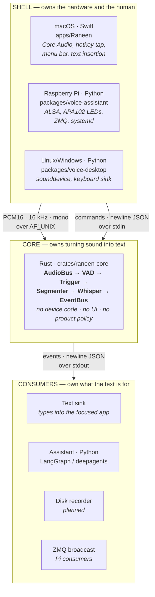
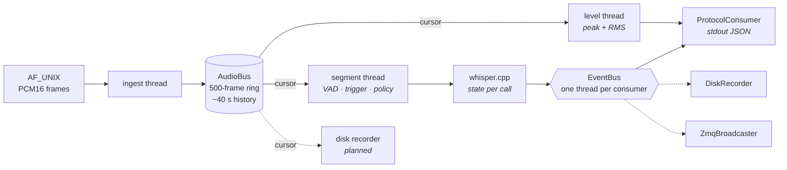

# Architecture

How the pieces fit, where the boundaries are, and which language owns what.

- **Why each boundary is where it is** → [DECISIONS.md](DECISIONS.md) (`AD-1`…`AD-17`)
- **What happens next** → [ROADMAP.md](ROADMAP.md)
- **Facts that cost us something to find** → [LEARNINGS.md](LEARNINGS.md)

---

## 1. The shape in one picture



Two rules explain everything below:

1. **The core never touches a device.** It takes bytes and returns text.
2. **The core never decides what the text is for.** Dictation types it, the
   assistant answers it, a recorder files it — all consumers of one event.

---

## 2. Three layers

### Shell — owns the hardware and the human

Device enumeration, hot-plug, disconnect, sample-rate conversion, hotkeys,
indicators, text insertion. One per platform, written in whatever that platform
speaks natively.

This is `AD-16`, and it is the decision that *deleted* the most code. Owning
devices through a portable C library (PortAudio, and `cpal` would be no better)
means reimplementing five workarounds — stale device lists, unstable indices,
host-dependent disconnect behaviour — that the platform API gives away free.

> A `cpal` dependency was added to the core on 2026-08-09 and removed the same
> day. It would have re-imported exactly what AD-16 deleted, on three platforms
> instead of one.

### Core — owns turning sound into text

Ring buffer, voice-activity detection, turn segmentation, transcription, event
fan-out. Rust. No device handles, no product policy — segmentation behaviour is
caller-supplied (`Policy`), never hardcoded.

**It is not macOS-specific.** The whole core carries *two* lines of
platform-conditional code (`mem.rs`, because `ru_maxrss` reports bytes on macOS
and kilobytes on Linux) and no platform-specific dependencies; `silero-vad-crs`
selects NEON or AVX2 automatically. It runs wherever a shell can feed it a
socket. The Pi still uses the Python pipeline because nobody has rewired its
shell yet — not because the core cannot go there.

### Consumers — own what the text is for

Everything downstream of `transcript`. The dictation sink, the assistant loop,
a disk recorder, a ZMQ bridge. Adding one adds a `Consumer`, never a mode.

---

## 3. Who owns what, in which language

| Concern | Language | Where | Why there |
| --- | --- | --- | --- |
| Device I/O, hot-plug, resampling | native per platform | `apps/Raneen` (Swift), `packages/voice-*/adapters` (Python) | `AD-16` — platform APIs already solve it |
| Hotkey capture, text insertion | native | `apps/Raneen` | needs an event tap; `CGEvent` can suppress one key, `pynput` cannot |
| Indicators (menu bar, LED, earcons) | native | shell | the indicator lives where the user looks |
| **Audio bus, VAD, segmentation, STT** | **Rust** | **`crates/raneen-core`** | hot path; memory and startup dominate |
| Conversation / agent loop | Python | `packages/voice-core/conversation` | LangGraph has no Rust equivalent, and shouldn't |
| Tools, MCP, music control | Python | `packages/voice-assistant/agent` | ecosystem lives there |
| Config, orchestration, packaging | per app | composition roots | `AD-2` — only the root knows both a port and a concrete type |

**Python is not being removed.** It is moving out of the *pipeline* and staying
where it is strongest: platform glue where devices are fiddly, and the agent
layer where the ecosystem lives.

---

## 4. Repo layout

```
protocol/                OWNED BY NO TOOLCHAIN — everything here ASSERTS
  README.md              the wire contract — the spec's only authority
  conform.py             drives ANY implementation; the anti-drift harness
  run-suite.sh           the suite CI runs
  zmq-check.py           always-on recording + concurrent dictation
  fixtures/*.wav         shared conformance audio
  doubles/               stand-in services, so tests need no network or key

tools/                   HUMAN-FACING — nothing here asserts
  zmq-watch.py           watch what a running core publishes
  which-core.sh          which core is the running app actually using
  try-live.sh, live.py   the real microphone, not a fixture

crates/
  raneen-core/          Rust — THE CORE
    src/bus/             AudioBus (ring + cursors), EventBus (fan-out)
    src/pipeline/        VAD detectors, tracker, TriggerMode, Policy
    src/stt/             the frame-level Stt trait + local/remote/realtime
    src/broadcast/       ZMQ publisher + the always-on recorder
    src/serve.rs         protocol loop — the composition root

apps/
  Raneen/                Swift — macOS shell
    Resources/           Info.plist, entitlements, the icon, brand assets

examples/                for CONSUMERS of the wire format, not core developers

packages/                Python — uv workspace (`members = ["packages/*"]`)
  voice-core/            ports, conversation layer, (legacy pipeline)
  voice-desktop/         desktop adapters + sidecar + CLI
  voice-assistant/       Pi app: ALSA, LEDs, ZMQ, agent
  alt-alexa-music-mcp/   music tools
```

**Scripts are filed by what they do, not by who wrote them.** The dividing
question is *does it assert?* Something with a pass/fail is part of the contract
and belongs in `protocol/`, where CI runs it. Something a person reads is a tool.
Something aimed at a consumer of the ZMQ format is an example.

This was not free to learn. Tools lived in three places — `protocol/`,
`apps/Raneen/scripts/`, `crates/raneen-core/scripts/` — sorted by authorship, and
when `conform.py` moved to `protocol/` both `try-live.sh` and this document kept
pointing at the old path. Neither broke visibly, because **a script nobody runs
in CI cannot fail loudly.** The split above is what stops that recurring.

**`crates/` is top-level, not under `packages/`,** because `packages/*` is a
`uv` workspace glob and a Cargo crate there breaks `uv sync`.

**On the name `raneen-core`.** Raneen is the **product brand** — the family, not
the macOS app. `apps/Raneen` is one shell within it; the Pi appliance and the CLI
are others. So naming the shared core after the brand is correct, and naming it
after any single shell would not be.

It was `voice-helper` until 2026-08-09, from the spike where it genuinely was a
helper: a drop-in for `voice-desktop serve`, ~700 lines, no buses, one consumer.
Once it grew the buses, the VAD and the segmentation policy that name described
its *runtime role* rather than what it is. Prose still calls it "the helper"
where that role is the point — it does run as a child process of a shell — but
the artefact is the core.

**Consequence to apply consistently.** The Python packages still use the older
`voice-*` prefix (`voice-core`, `voice-desktop`, `voice-assistant`). Bringing
them under the brand is right eventually, but `AD-3` warns why not yet: systemd
units, the `voice-assistant` CLI entry point and the Pi deployment docs all
reference those names, and renaming a running deployment buys nothing today.
Do it when the Pi moves onto this core, not before.

**Why `protocol/` is top-level and owned by nobody.** There are two
implementations of this contract. The spec's authority used to be a *Python
docstring*, which made the newer implementation a guess at the older one's
behaviour; and `conform.py` drives **both**, so living inside one crate was an
accident of where it was written. Drift between the two is the single biggest
risk this architecture carries — the thing guarding against it should not be
buried in the newer one.

No JSON Schema files until something generates code from them. Seven event types
do not need a schema language; they need one place the spec lives and a harness
that checks it.

### What deliberately does not change

**Do not split the Rust crate into a workspace yet.**

A five-crate split (`voice-protocol` / `voice-core` / `voice-stt` / `voice-helper`
/ `voice-pi`) was sketched before the rename. It is premature: the entire Rust core is ~1,400
lines and produces **one binary**. Crate boundaries buy an enforced dependency
direction and separate compilation; module boundaries already give the structure,
and `src/bus/` + `src/pipeline/` having no device dependency is currently
guaranteed by the crate having none at all.

The trigger to revisit is concrete: **a second Rust binary that needs to share
only part of this one.** Until then a workspace buys version coordination and
cross-crate refactor friction in exchange for tidiness.

**Do not build a `crates/voice-pi` that captures audio.** It has been proposed
with "cpal capture + ZMQ + LED indicator". Either it is the Pi's *shell* — a peer
of Raneen, and then it is fine — or it is device code in the core, which is
`AD-16` reversed and was already backed out once. The cheaper answer is that
Python keeps owning ALSA on the Pi: it works today, it is shipping, and it needs
no new capture code in any language.

**A root `Makefile`** delegating to the three toolchains (`make app`, `make test`,
`make conform`) is low-cost and worth having once the Rust helper is bundled.

---

## 5. Inside the core: two buses, deliberately different



|  | `AudioBus` | `EventBus` |
| --- | --- | --- |
| Rate | 12.5/s, forever | a few per utterance |
| History | 40 s ring, **rewindable** | none — a fact, once |
| Slow consumer | loses frames | builds its own queue |
| Fan-out cost | `Arc` refcount | `Arc` refcount |

Three consequences worth stating outright:

- **`rewind()` *is* pre-roll.** A VAD reports "started" only after its threshold,
  so recording begins ~240 ms into the first word. Reaching backwards fixes it,
  and the ring already holds the audio. A broadcast channel could not express this.
- **Level metering is not an event.** At 12.5/s it would drown every consumer
  that only wanted to know a sentence finished. It gets its own cursor.
- **Ordering is structural.** One thread per `Consumer` gives per-consumer FIFO
  for free — Python's `order_key` has no counterpart to get wrong.

---

## 6. One pipeline, four triggers

Always-on and push-to-talk are **not** separate code paths. A trigger only
decides *whose boundary counts* (`AD-7`, `AD-12`):

| mode | opens a turn | closes it | text arrives |
| --- | --- | --- | --- |
| `hold` | key down | key up | on release |
| `vad` | speech | silence | per sentence |
| `toggle` | speech, once enabled | silence | per sentence |
| `wake_word` | the wake word | silence | per utterance |

The detector runs in **every** mode, because the indicator still wants to know
you are speaking even when your key owns the turn. Only `hold` ignores the VAD's
stop — otherwise pausing for breath would chop a held paragraph in two.

`Policy` carries what the caller decides: `continuous`, `drop_stale`,
`max_seconds`, `pre_roll_frames`, `silence_frames`, `min_confidence`, `language`.
Dictation sets `drop_stale = false`; a turn-based assistant sets the inverse.

---

## 7. Efficiency is a design constraint, not a later optimisation

This runs all day in a menu bar. It must be invisible in Activity Monitor, and
on a Pi it shares 2–8 GB with everything else. Every number here is measured on
an M-series Mac with `base.en` q5_1 — none is estimated.

| | Python core | Rust core |
| --- | --- | --- |
| Process start | 34 MB | **6 MB** |
| Model loaded | 386 MB | **70 MB** |
| **Resting, model resident** | ~480 MB | **65–90 MB** |
| Peak during inference | 576 MB | 220 MB |
| Model load | 0.79 s | **0.05 s** |
| Inference, 5.8 s audio | 0.56 s | **0.28 s** |
| Binary | 187 MB bundle | **2.1 MB** + 57 MB model |

### The rules that produced those numbers

**1. The model is the memory. Everything else is rounding.**
57 MB of weights against ~10 MB of everything we wrote. Optimise model choice
and quantisation first; micro-optimising our own allocations is noise. `base.en`
q5_1 beat f16 by 85 MB *and* was more accurate than multilingual `base`.

**2. Per-call state, not per-process.**
whisper.cpp allocates ~200 MB of conv/encode/decode scratch **per state**.
`Engine::transcribe` creates the state per call, so it is returned the moment
decoding ends. Holding one alive between segments would make the peak the floor —
220 MB resident instead of 88.

**3. Fan out with refcounts, not copies.**
Frames are `Arc<[i16]>`, events `Arc<Event>`. Adding a consumer costs a refcount.
This is what makes "add a disk recorder" free rather than a second copy of the
audio.

**4. Bound every buffer, and decide what to drop.**
The ring is 500 frames. The level meter's backlog caps at 8. The earcon mailbox
holds one slot. Unbounded queues do not fail — they succeed slowly and then
exhaust memory hours later, which is far harder to diagnose.

**5. Never block a real-time thread.**
Core Audio's callback and the socket reader do one thing and hand off. A slow
consumer delays only itself: that is precisely what buys the freedom to do
blocking disk I/O next to a protocol writer that must not stall.

**6. Idle must cost nothing.**
VAD gates inference, so CPU scales with *speech*, not with wall time. This is
what makes always-on viable at all — and why a neural VAD earns its 1 MB: on a
noise fixture, energy detection opened 3 turns to Silero's 1, and each phantom
turn wakes the model.

**7. Measure the process, not the allocator.**
`footprint` / `phys_footprint`, and RSS sampled fast enough to catch a 0.3 s
inference spike. Sampling at 1 Hz once made peak memory look like a property of
the VAD when it was a property of *when we looked*.

**8. Long-lived loops must drain their own pools.**
A GCD block that never returns never drains its autorelease pool. That was
**2.8 GB** in the Swift shell — more memory than everything else in this document
combined, from ~20 lines. See [LEARNINGS.md](LEARNINGS.md).

---

## 8. The protocol

The seam from `AD-15`. One JSON object per line, both directions. **stdout
carries protocol, not prose** — every diagnostic goes to stderr.

```
host → core                    core → host
  {"cmd":"arm"}                  {"event":"ready", "engine":…, "model":…,
  {"cmd":"disarm"}                "audio":{…}, "capture":"host"|"helper"}
  {"cmd":"toggle"}               {"event":"state","pattern":"armed|listen|think|…"}
  {"cmd":"ping"}                 {"event":"transcript","text":…}
  {"cmd":"quit"}                 {"event":"level","peak":…,"rms":[4]}
                                 {"event":"error","message":…}
                                 {"event":"pong","armed":…}
                                 {"event":"bye"}
```

Audio flows separately: PCM16 / 16 kHz / mono / 1280-sample frames over AF_UNIX.
**Not** TCP (macOS prompts for incoming connections on every launch), **not** a
FIFO (non-blocking open reports EOF before the writer arrives — indistinguishable
from a real disconnect), **not** base64 in the control stream.

Because the protocol is language-neutral, it is also the **anti-drift mechanism**:
`protocol/conform.py` drives *any* implementation, so Rust and
Python can be held to the same fixtures. It has already caught a real divergence.

---

## 9. Invariants

Break these deliberately or not at all.

1. The core imports no device library and contains no `cfg(target_os)`.
2. `voice_core` (Python) imports nothing from an app package. Asserted in CI.
3. Audio on the wire is always PCM16 / 16 kHz / mono. A mismatch is a startup
   error, never a page of plausible nonsense.
4. stdout is protocol. Nothing else may write to it.
5. Product policy lives in the composition root, never in the pipeline.
6. Failure is loud. A silently dropped transcript is indistinguishable from a
   dead microphone — the single most expensive bug class in this domain.
